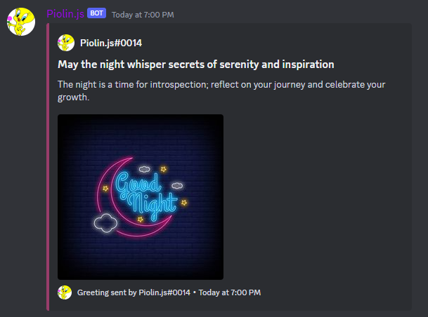
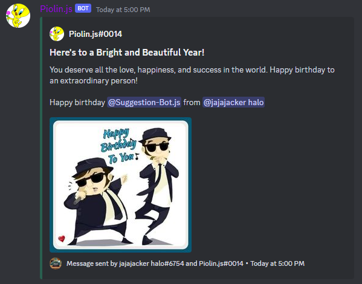
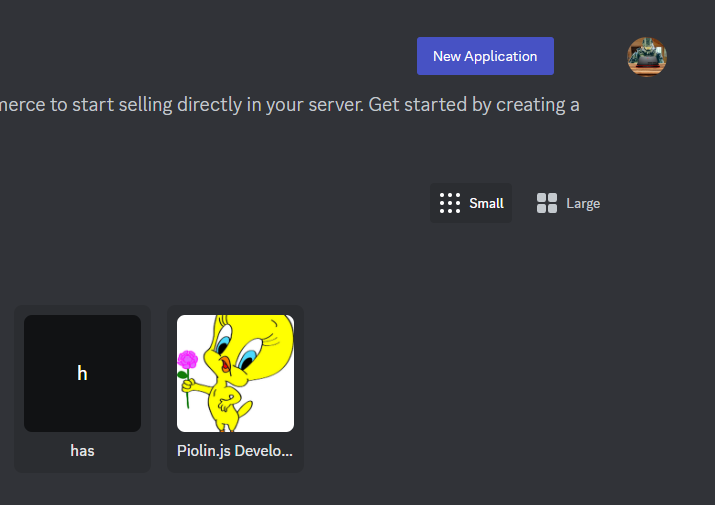
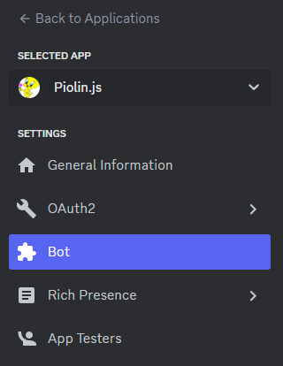
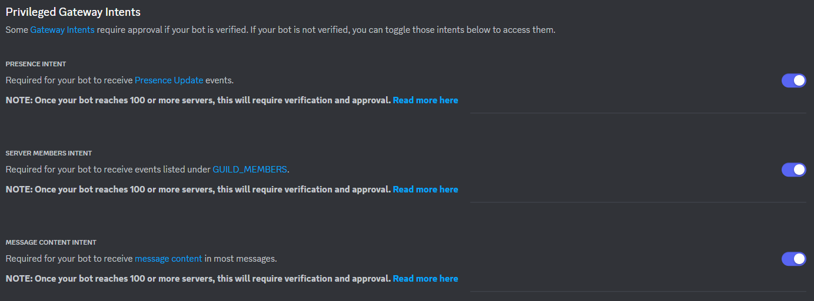
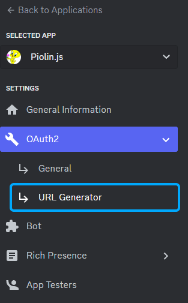
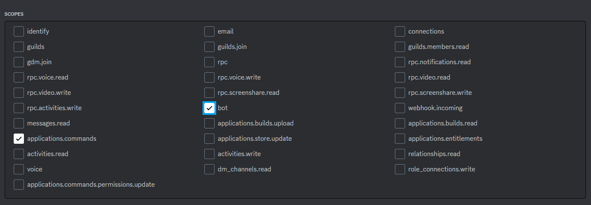

# Piolin.js, a basic Discord bot whishing you a great day every day

## **INDEX**

- [Piolin.js, a basic Discord bot whishing you a great day every day](#piolinjs-a-basic-discord-bot-whishing-you-a-great-day-every-day)
  - [**INDEX**](#index)
  - [Project Description](#project-description)
    - [Technologies Used](#technologies-used)
  - [Commands List](#commands-list)
  - [Contributions](#contributions)
    - [Contribution Process](#contribution-process)
    - [Contribution Guidelines](#contribution-guidelines)
  - [How to Use the Project](#how-to-use-the-project)
  - [License](#license)
  - [Gratitude](#gratitude)

## Project Description

*Hey, I'm glad you have arrived at this project, before the whole project description I would like to leave the invite link of my bot if you want to make use of it:*

**<https://discord.com/api/oauth2/authorize?client_id=1103790916466131065&permissions=277025638464&scope=bot%20applications.commands>**

Piolin.js is a simple Discord bot with one simple purpose in mind, sending greetings to everyone inside a Discord server everyday. When you add Piolin.js to your Discord server you'll be able to use a series of commands to personalize your experience with the different greetings of the bot, below I leave a small description of the commands.

  `all-greetings`: This command is a simple and easy way to configure the bot in your server, with this command the bot will send automatically the different greetings during the day, more specifically at 7 AM, 12 PM and 7 PM, each one being the good morning greeting, the good afternoon greeting and the good night greeting respectively.

  `good-morning-greeting`: This command allows the user to configure the bot so that it only sends the good morning greeting, the time doesn't change, it stays at 7 AM

  `good-afternoon-greeting`: The same as the `good-morning-greeting`, this command will make the bot send only the good afternoon greetings at 12 PM.

  `good-night-greeting`: Equal to the past two commands, with this command you'll only receive the good night greeting at 7 PM.

In the case of this commands the structure of the message is the same:

  A basic title related to the time of the day.
  A description related to the title.
  An image.

Every message is send as an embed so that it is more attractive to the user.

**You MUST select a channel and a timezone for the commands to work.**

Here is an example:



As the user you are able to select a timezone, in this case you select a principal city, lets say New York, whit this information the bot will send the message at the specified hours at the user's time, with this we make sure that you receive the message at the correct hour and the experience is way better for everyone on the server.

If you want to know what the other commands do you can jump to [Command list](#commands-list)

### Technologies Used

This bot uses the following technologies to work properly:

  Node.js.
  Discord.js.
  Fs.
  Path.
  Node-Schedule.

The single most important technology used on this project is Node.js, this technology allows us to easily have a runtime environment for out bot, making JavaScript able to create this type of projects without the use of more complex technologies[^1].

Following Node.js we have, Discord.js, one of the best libraries for the creation of Discord bots using JavaScript, this library allows us to easily create our bot, and most importantly create the command and event handlers which makes the creation of the bot a lot easier, not only for the first version but for the following versions because of it being very simple to update, add, delete or change things like the commands code or even the events, although Piolin.js isn't connected to a database, Discord.js also makes it easier to connect the bot to a database allowing for even more flexibility and more in depth bots.

Both Fs and Path are the following libraries used in this bot, this libraries are very important because are the ones used not only for the command and event handlers but also for the upload of the command to Discord's API, and for the response when a command or event is triggered.

Last but not least is Node-Schedule, this is the library that allows the bot to send the different greetings, daily quotes and birthday celebration messages at the selected time on the selected timezone. This library gives the user a easy to understand way to properly set different tasks at a selected date and time.

## Commands List

Here is a full list of the commands available on Piolin.js, keep in mind that I'm skipping the commands that I've already mentioned above:

  `happy-birthday`: This command as the name specifies is centered in sending a happy birthday, for this command to work the user needs to fill the following inputs:

  1. User: This input is required so that the bot can give the happy birthday celebration to the intended user.
  2. Channel: The user needs to select where he wants the message to be sent.
  3. Date: The date of the user's birthday, it must be send in the following format MM-DD.
  4. Timezone: The bot sends the message at 5 PM, but to make better for the user is important to select the user's timezone to have the best user experience.

When the birthday date arrives, the bot will send a message like this:



  `daily-quote`: As the name indicates, the bot sends a daily quote from a historical figure, in this case the quotes are centered in motivation, the competition of goals and dreams, etc...

  In this case, similar to the `happy-birthday` command the bot need a series of inputs, in this case it needs two:

  1. Timezone: The bot will send this type of messages everyday at 2 PM, for a better experience the user needs to add a timezone so the message arrives at 2 PM at the time where the user is.
  2. Channel: The user needs to select a channel where he wants to receive the message.

  `help`: This commands sends a message in the form of an embed with all the information related to the commands.

  `ping`: With this command the user can now the latency of the bot and also know if the bot is working properly.

## Contributions

At the moment I'm not interested in adding new features to the bot because I want to focus in new projects, but if you want to add new features, or use this bot as a template or way to learn about JavaScript, Node.js and Discord.js you are free to contribute to this project, but for this reason I leave below the contribution process and a series of guidelines for the contributors:

### Contribution Process

Here is a list of the things that you should do to contribute to this project:

  1. Fork this repository and clone it to your local machine.
  2. Create a new branch for you contribution using:
    `git checkout -b "the name of your contribution"`.
  3. Make the necessary changes and improvements on your local branch.
  4. Make sure to follow a style guideline and maintain a code consistency.
  5. Commit your changes using:
    `git commit -m "commit description"`.
  6. Open a pull request so I can review your changes.

### Contribution Guidelines

  1. Please maintain a respectful and friendly tone in all interactions related to this project.
  2. If you're reporting a bug, provide detailed information on how to reproduce it.
  3. If you're proposing a new feature, explain its usefulness and provide code examples if possible.
  4. Whenever possible, include unit tests or integration tests to support your changes.

I appreciate your time and contributions to make this project better. I look forward to your participation!

## How to Use the Project

If you want to use this bot follow these steps:

  1. Go to <https://discord.com/developers/applications> and create a new application on the `New Applications` button at the top right corner.
    
  2. After you have created a new application go to the "Bot" option on the left menu.
    
  3. Add all the Privileged Gateway Intents to your application.
    
  4. Go to OAuth2 and then choose URL Generator, here your gonna create the link invite of your bot.
    
  5. On Scopes select `bot` and `applications.commands`.
    
  6. After this a new window called `BOT PERMISSIONS` will appear, on this select the following options.
    
  7. Now copy your bot invite link on the bottom of the page, then add it to your Discord server.
  8. On this repository you'll see a file called `configExample.json`, inside of this file you will see the following.

    ```json
    {
      "TOKEN": "BOT'S_TOKEN",
      "CLIENT_ID": "BOT'S_ID"
    }
    ```

  Change the information and add your bot information, to obtain your bot ClientID you need to go to `General Information` on the left menu, you'll see a title that says `APPLICATION ID` right below your bot description.

  For your bot token go to `Bot` on the left menu and below your bot name you have a section called `TOKEN`, press the reset token and follow the instructions to obtain the token.

  After this, put the information on the `configExample.json` file and change the name to `config.json`, if you did all of the steps correctly you'll be able to put this bot online and start making contributions.

## License

This project is created under the BSD License. Consult the LICENSE file for more details.

## Gratitude

I want to show my gratitude and respect to all the people that make part of the Discord.js team, a group of persons that created a truly incredible library for the creation of Discord bots, also I want to show my respect to the persons running the YouTube Channel "Under Ctrl" or "notunderctrl" on GitHub, for being one the main reasons of keep on trying and creating Discord bots with his short and easy to understand videos related to the creation of Discord bots, I leave all the links related to "Under Ctrl" and "Discord.js" below.

Under Ctrl related links:

- Under Ctrl YouTube Channel: <https://www.youtube.com/@underctrl>
- Under Ctrl GitHub Profile: <https://github.com/notunderctrl>
- Under Ctrl Discord Server: <https://discord.underctrl.io>

Discord.js related links:

- Discord.js Website: <https://discord.js.org/>
- Discord.js Guide: <https://discordjs.guide/>
- Discord.js GitHub Repository: <https://github.com/discordjs/discord.js>
- Discord.js GitHub Profile: <https://github.com/discordjs>
- Discord.js Documentation: <https://old.discordjs.dev/#/docs/discord.js/main/general/welcome>
- Discord.js Discord Server: <https://discord.gg/djs>

[^1]: For a better understanding of node.js, see <https://www.freecodecamp.org/news/what-is-node-js/>
